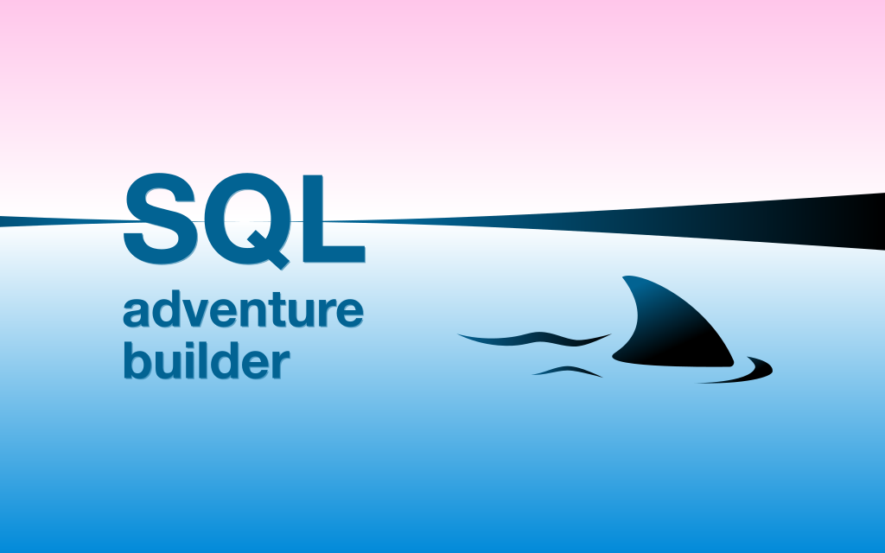

# SQLab



An SQLab adventure is a text-based game where the player evolves through a series of isolated or interconnected puzzles by crafting SQL queries.

It consists in a standalone database encompassing the core dataset, a handful of stored procedures, and a table of encrypted messages (such as narrative elements, puzzle statements, answers, explanations, etc.).

There is no requirement to wrap a dedicated application around this database to “run” the game. It can be played on any generic GUI such as [DBeaver](https://dbeaver.io), [phpMyAdmin](https://www.phpmyadmin.net), [pgAdmin](https://www.pgadmin.org), or directly in a command-line interface.

Each question comes with a unique formula, for example, `salt_042(sum(hash) OVER ())`. Appended to the `SELECT` clause, this formula calculates a decryption token, which may unlock the next episode or, if the query is incorrect, a tailored hint (assuming the game's creator has provided one).

In an educational context, this setup enables the students to learn and practice SQL without constant oversight. The instructor might stave off boredom by logging their queries and injecting new hints as needed, improving the game for all involved.

## Examples on GitHub

| Game | Pitch | Versions | DBMS | Included |
| --- | --- | --- | --- | --- |
| [SQLab Island](https://github.com/laowantong/sqlab_island) | An adaptation of [SQL Island](https://sql-island.informatik.uni-kl.de) by Johannes Schildgen | English | MySQL, PostgreSQL, SQLite | Sources + SQLab database |
| [SQLab Sessform](https://github.com/laowantong/sqlab_sessform) | A set of independent exercises + _Mortelles Sessions_, a police investigation on a training company | French | MySQL, PostgresQL | SQLab database |
| SQLab Club | An adaptation of [PostgreSQL Exercises](https://pgexercises.com) by Alisdair Owens | English | PostgreSQL | Sources + SQLab database (coming later) |
| SQLab Corbeau | An original adaptation of the movie [_Le Corbeau_](https://fr.wikipedia.org/wiki/Le_Corbeau_(film,_1943)) by Henri-Georges Clouzot (1943) | French | MySQL | SQLab database (coming later) |

## How can I create my own SQLab adventure?

The `sqlab` command-line tool is not required to play, but is necessary to create a new adventure.

```
pip install sqlab
```

The documentation is not yet available. In the meantime, you may explore the repository of [SQLab Island](https://github.com/laowantong/sqlab_island). The provided dataset and Jupyter notebooks serve as source material for the generation of the SQLab database.
